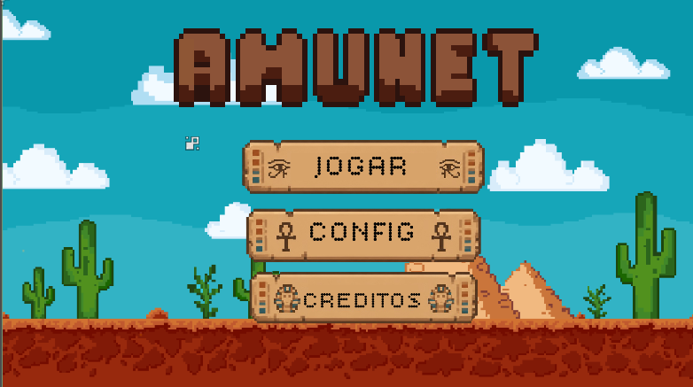
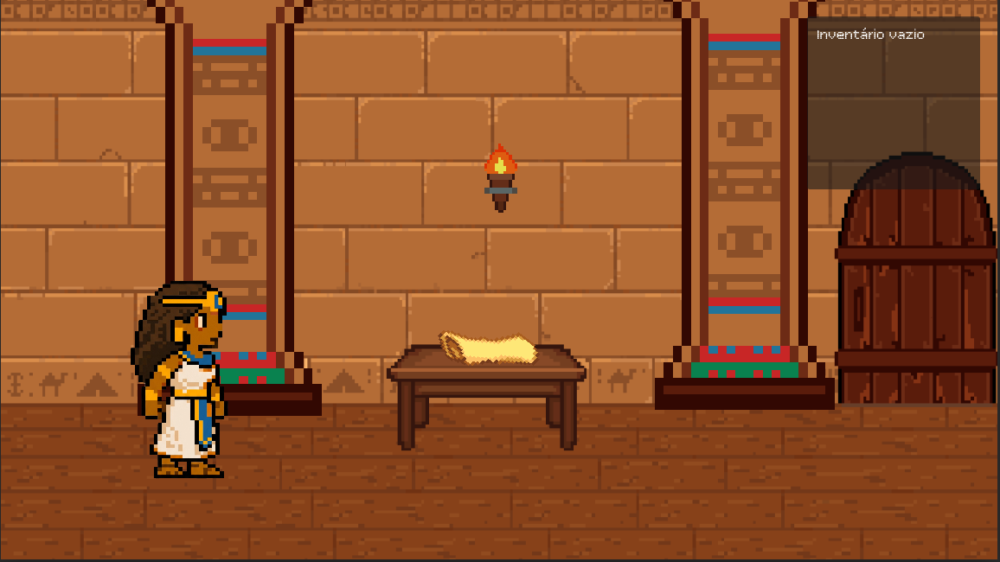
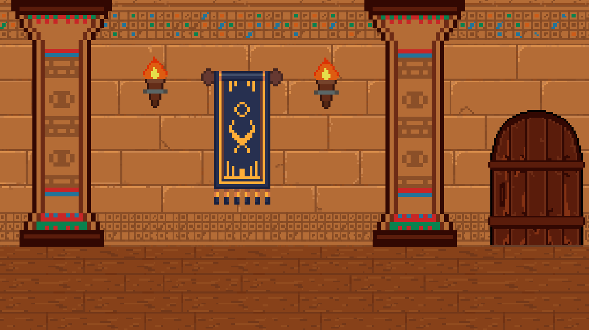
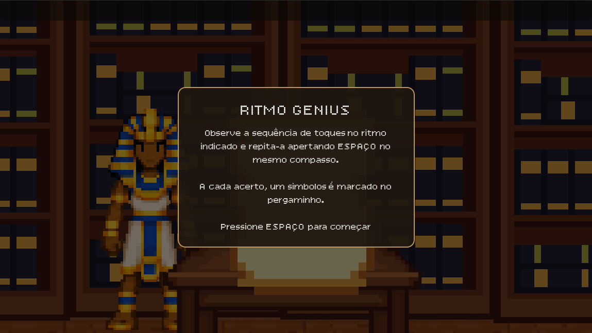
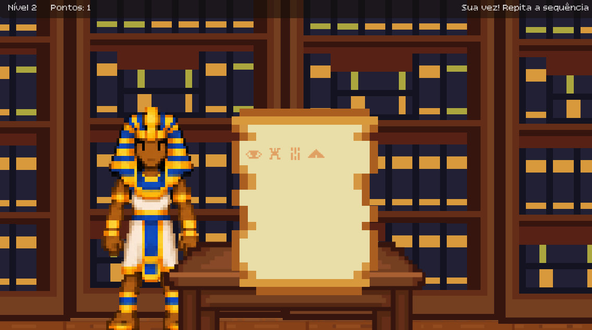

<!DOCTYPE html>
<html lang="pt-BR">
<head>
  <meta charset="UTF-8">
  <meta name="viewport" content="width=device-width, initial-scale=1.0">
  <title>2026-303-Amunet</title>
</head>
<body>

  <h1>2026-303-Amunet</h1>
  

    Repositório oficial do jogo desenvolvido para a disciplina de <b>Tópicos Avançados de Programação Orientada a Objetos (TAPOO)</b> do COLTEC / UFMG.
  

  <h2>Sobre o Jogo</h2>
  

    <b>Amunet</b> é um jogo focado na exploração de mistérios no Egito Antigo. O jogador transita entre ambientes como o interior de uma pirâmide e um quarto temático egípcio. 
    Toda a direção de arte foi feita em <b>pixel art</b>, combinando iluminação interior, ruínas e móveis característicos da época.
  

  <h2>Estrutura de Cenas do Projeto (Godot)</h2>
  
O projeto é estruturado utilizando a engine Godot e conta com as seguintes cenas e ambientes mapeados[cite: 1]:

  <ul>
    <li>
      <b>Menu Principal / Interface de Usuário (UI):</b>
      <ul>
        <li>Interface baseada em botões de pergaminho antigo.</li>
        <li>Opções de navegação: <i>Jogar</i>, <i>Configurações</i> e <i>Créditos</i>.</li>
      </ul>
    </li>
  </ul>

  

    
  

  <ul>
    <li>    
      <b>Cenas de Cenários, Interação e Desafios:</b>
      <ul>
        <li>
          <b>Quarto Temático e Exploração Inicial:</b> Um ambiente modelado em pixel art com estética egípcia, onde o jogador encontra uma mesa interativa contendo um pergaminho antigo. O cenário conta ainda com iluminação por tochas de parede e elementos decorativos de pedra e madeira que constroem a atmosfera de mistério.
          

            
          

        </li>
        <li>
          <b>Corredores e Encontro com NPCs:</b> Nos corredores das ruínas e pirâmides, a protagonista Amunet transita por caminhos estreitos e ladeados por colunas antigas. É nestas áreas de transição que ela se depara com NPCs (personagens não jogáveis) estratégicos, responsáveis por fornecer diálogos enriquecedores, pistas sobre o local e direcionamentos para o prosseguimento da aventura.
          

            
          

        </li>
        <li>
          <b>Sala Principal e Resolução de Puzzles:</b> A câmara central do mapa, caracterizada por sua arquitetura imponente e detalhes hieroglíficos nas paredes, serve como o ponto focal para o grande puzzle do jogo. É neste ambiente que o jogador precisa aplicar a lógica e utilizar as pistas coletadas nos pergaminhos e conversas para resolver o enigma e desbloquear novas áreas.
          

            
          

          

            
          

        </li>
      </ul>
    </li>
    <li>
      <b>Protagonista e Interface:</b>
      <ul>
        <li><b>Amunet:</b> Design de sprite detalhado da protagonista, acompanhada pelo sistema de UI no canto superior direito que gerencia o inventário de itens e pergaminhos obtidos durante a exploração.</li>
      </ul>
    </li>
  </ul>

  <h2>Acessibilidade</h2>
  
Para garantir uma experiência inclusiva, o jogo conta com opções configuráveis no menu de acessibilidade[cite: 1]:

  <ul>
    <li><b>Filtros para Daltonismo:</b> Ajustes de paleta de cores para facilitar a identificação visual de elementos do jogo.</li>
    <li><b>Suporte e Ajustes para Tourette:</b> Mecânicas e configurações adaptadas para redução de estímulos visuais agressivos ou comandos involuntários.</li>
  </ul>

  <h2>Equipe e Desenvolvimento</h2>
  <ul>
    <li><b>Arthur David</b> - Programação, Lógica do Jogo e Implementação dos Recursos de Acessibilidade.</li>
    <li><b>Sofia Gabriele</b> - Arte, Design de Sprites/Cenários e Acessibilidade Visual[cite: 1].</li>
  </ul>

</body>
</html>

</body>
</html>
